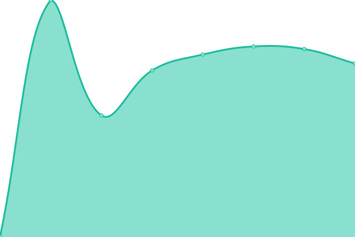
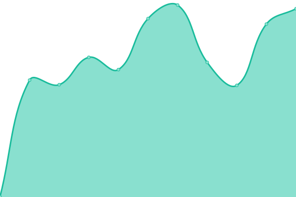
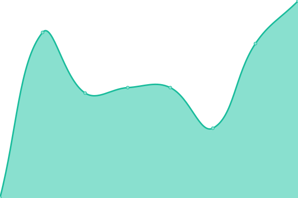
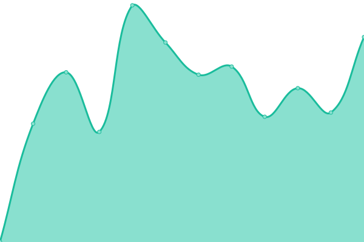
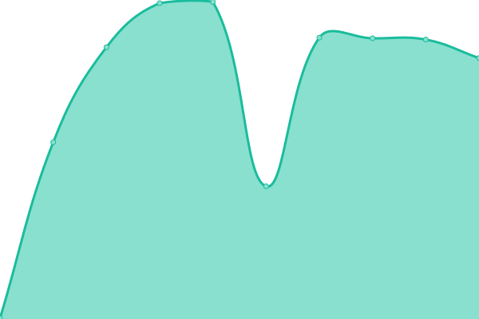

# [📈 Live Status](https://mass-im.github.io/forest-status-test): <!--live status--> **🟧 Partial outage**

This repository contains the open-source uptime monitor and status page for [Massim Knaapen](https://www.gohike.nl), powered by [Upptime](https://github.com/upptime/upptime).

With [Upptime](https://upptime.js.org), you can get your own unlimited and free uptime monitor and status page, powered entirely by a GitHub repository. We use [Issues](https://github.com/mass-im/forest-status-test/issues) as incident reports, [Actions](https://github.com/mass-im/forest-status-test/actions) as uptime monitors, and [Pages](https://mass-im.github.io/forest-status-test) for the status page.

<!--start: status pages-->
<!-- This summary is generated by Upptime (https://github.com/upptime/upptime) -->
<!-- Do not edit this manually, your changes will be overwritten -->
<!-- prettier-ignore -->
| URL | Status | History | Response Time | Uptime |
| --- | ------ | ------- | ------------- | ------ |
|  [Forest.host](https://forest.host) | 🟩 Up | [forest-host.yml](https://github.com/mass-im/forest-status-test/commits/HEAD/history/forest-host.yml) | 

 738ms
     
 | 

<a href="https://mass-im.github.io/forest-status-test/history/forest-host">100.00%</a>
    

|  [api.forest.host](https://api.forest.host/v1/auth/providers) | 🟩 Up | [api-forest-host.yml](https://github.com/mass-im/forest-status-test/commits/HEAD/history/api-forest-host.yml) | 

 562ms
     
 | 

<a href="https://mass-im.github.io/forest-status-test/history/api-forest-host">100.00%</a>
    

|  [api.tinytrees.nl](https://api.tinytrees.nl/v1/auth/providers) | 🟩 Up | [api-tinytrees-nl.yml](https://github.com/mass-im/forest-status-test/commits/HEAD/history/api-tinytrees-nl.yml) | 

 423ms
     
 | 

<a href="https://mass-im.github.io/forest-status-test/history/api-tinytrees-nl">100.00%</a>
    

|  [app.forest.host](https://app.forest.host/) | 🟩 Up | [app-forest-host.yml](https://github.com/mass-im/forest-status-test/commits/HEAD/history/app-forest-host.yml) | 

 952ms
     
 | 

<a href="https://mass-im.github.io/forest-status-test/history/app-forest-host">100.00%</a>
    

|  Leaf.cloud network | 🟥 Down | [leaf-cloud-network.yml](https://github.com/mass-im/forest-status-test/commits/HEAD/history/leaf-cloud-network.yml) | 

 0ms
     
 | 

<a href="https://mass-im.github.io/forest-status-test/history/leaf-cloud-network">0.00%</a>
    

<!--end: status pages-->

[**Visit our status website →**](https://mass-im.github.io/forest-status-test)

## 📄 License

- Powered by: [Upptime](https://github.com/upptime/upptime)
- Code: [MIT](./LICENSE) © [Massim Knaapen](https://www.gohike.nl)
- Data in the `./history` directory: [Open Database License](https://opendatacommons.org/licenses/odbl/1-0/)
